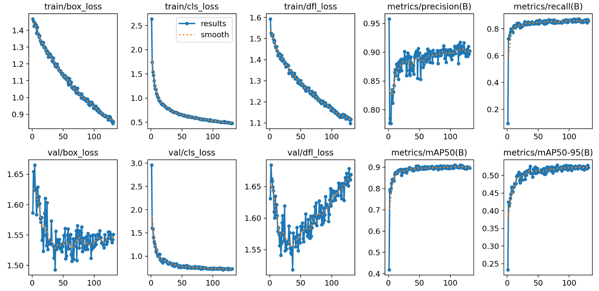
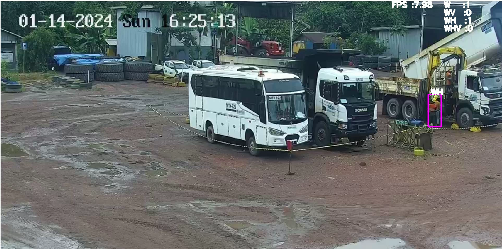

# Personal Protective Equipment (PPE) Detection
[](https://www.python.org/downloads/release/python-380/)


## Installation

This program was running on AMD Ryzen 5 CPU, for faster inferene you can use GPU

Create new anaconda env
```
conda create -n <env-name> python=3.8
```


Clone the repository first and install all the requirements. All the requirements are [here](./requirements.txt)
```
pip install -r requirements.txt
```


Run the main.py

```
python main.py
```

# Main.py Arguments

## Arguments:

| Argument  | Description                                      | Default Value |
|-----------|--------------------------------------------------|---------------|
| --input   | Input File (use "filepath" or leave empty for webcam) | "" (empty string) |
| --conf    | Detection Confidence (float)                     | 0.5           |
| --save    | Save Detection Result (True/False)               | False         |
| --show    | Show Detection Result (True/False)               | False         |


## Dataset

This YOLOv8 model was trained using this dataset [here](https://github.com/ciber-lab/pictor-yolo) .This dataset was chosen because it represents real-time detection of construction-related objects (e.g.,building, equipment, worker).

## Model Used

- YOLOv8n (1024 imgsz) [repo](https://github.com/ultralytics/ultralytics)


## Pipeline Model

A Yolov8  Model was first inferenced to get worker, hat, and vest bounding box, then I separated the worker, and (hat,vest), calculate the intersection value betwen worker and each equipment found in the picture. The biggest intersection value between worker and equipment found means that it equipments belongs to the worker. Then, I create the bounding box for the person and labelled with W (Worker),WH (Worker-Helmet),WV (Worker-Vest), and WHV (Worker-Helmet-Vest).


## Training & Evaluation Result


- ### YOLO Training Model

    Model was trained using 300 epoch and 16 batch . To train the model,
    
    ```
    yolo detect train model=yolov8.pt epoch=300 batch=16 data=data.yaml imgsz=640
    ```
    
    Evaluate model
    
    ```
    yolo detect val model={model_dir} data=data.yaml imgsz=640
    ```
    
    Results
    

## Inference Result

The inferenced video result can be found [GoogleDrive](https://drive.google.com/drive/folders/1iiCLDyUZfwLlIklHdQvoRAqSS637kRyJ?usp=sharing)


